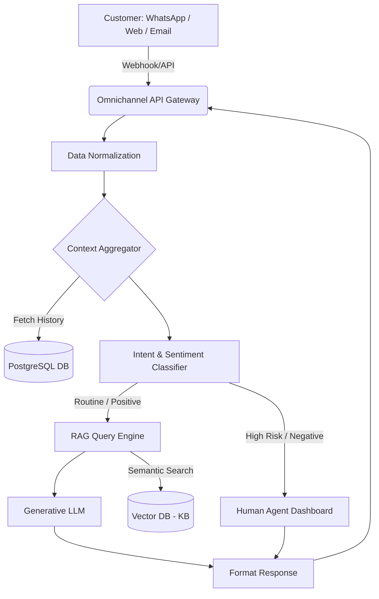

# AI Blueprint

## System Architecture & Data Flow Diagram

The Omnichannel AI Platform uses a microservices-based architecture to process incoming messages, aggregate context, route queries, and generate responses.

### High-Level Data Flow

1. **Ingestion Layer (Omnichannel API Gateway)**
   - Receives events via Webhooks from WhatsApp Business API, Email Servers (IMAP/SMTP), and Web Chat Widgets.
   - Normalizes the payload into a standard `Interaction` schema.

2. **Context Aggregation (The "Brain")**
   - Queries the Customer Database (built on PostgreSQL) to fetch user profile, recent orders, and past interaction history across all channels.
   - Compiles this timeline into a structured text prompt.

3. **Routing Engine (Fast LLM / Intent Classifier)**
   - Analyzes the specific message in real-time.
   - Extracts `Intent` (e.g., "Cancel Order", "Question") and `Sentiment` (0.0 to 1.0).
   - *Decision Branch:* 
     - **Urgent/High-Risk/Complex:** Routes to Human Queue.
     - **Routine/Simple:** Proceeds to RAG Generation.

4. **Generation Engine (RAG - Retrieval-Augmented Generation)**
   - Vector database (e.g., Pinecone or pgvector) fetches relevant Knowledge Base articles based on the `Intent`.
   - A larger LLM constructs a personalized response using the User Context, the active Question, and the fetched KB articles.

5. **Execution & Delivery**
   - The platform sends the generated response back through the OmniChannel API Gateway to the specific platform (e.g., WhatsApp).
   - If human agents are involved, the Agent Dashboard updates via WebSockets in real time.

